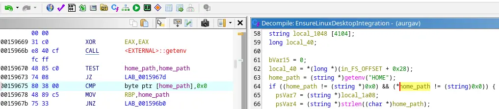

I recently discovered a cheap KVM from a friend called Aurga Viewer
(see [blog post](/blog/aurga-viewer)).
The desktop software can be downloaded from their Github. I preferably install
software through my package manager, so the software can be kept easily up to
date. I use `paru` together with the Arch User Repository (AUR) for that.
AUR is a collection of user-submitted packages for Arch Linux. Nobody submitted
Aurga Viewer yet, so I thought it was time to create my first package there:
[aurga-viewer-bin](https://aur.archlinux.org/packages/aurga-viewer-bin)

Here is a breakdown of how I packaged `aurga-viewer-bin`, verified it, and
published it to the AUR.

---

The [Arch Wiki](https://wiki.archlinux.org/title/Creating_packages)
already describes this process in great detail, but some tricks are not clear.

## 1 Look into examples

At every package's heart is a `PKGBUILD` file, it contains the information
needed to download and install the package.

I started by looking into existing packages. In this case the software was
already compiled and closed source. Precompiled packages end with `-bin`.
One example would be [brave-bin](https://aur.archlinux.org/packages/brave-bin).

## 2 Create PKGBUILD

Using other packages as examples should be enough to get a basic `PKGBUILD`
down. A tool called `updpkgsums` is very useful to automatically set the
`SHA-256` sums. It can be installed like this:

```sh
sudo pacman -S pacman-contrib
```

Then run this in the project directory:

```sh
updpkgsums
```

## 3 Verify PKGBUILD

Another really helpful tool is `namcap`. It shows exactly which dependencies
are missing and other hints. Although not all hints from the tool are correct.

```sh
sudo pacman -S devtools
```

Build and verify:

```sh
makepkg -s
namcap [YOUR-PACKAGE].pkg.tar.zst
```

It is strongly recommended to test your package in a clean environment.
To create an isolated environment from your installed packages use this:

```sh
extra-x86_64-build
```

## 4 Problems with my software

### Duplicate Desktop Entry

When testing the installation with:

```sh
makepkg -fi
```

I ran into the issue that my program menu `fuzzel` (a Wayland alternative
to `dmenu`) showed "AURGA Viewer" twice. `fuzzel` is finding any program through
a Desktop file. Those can be located in `~/.local/share/applications` for
user applications and `/usr/share/applications` for system apps.

I created a desktop file in `/usr/share/applications` because the software is
installed system-wide. The problem is the program creates a desktop file in
`~/.local/share/applications` when you run it.

I came up with three options:

1. Remove my system-wide desktop file. Problem: Before the first launch there
   will be no desktop entry. I tried to find a "create desktop file" argument
   like `aurga-viewer --desktop-file` but without luck.

2. Modify the path `~/.local/share/applications` in the binary executeable.
   Problem: This is a dirty solution. The byte size of the replacement string
   has to match or else it could result in memory corruption bugs.

3. Analyze how the application is doing the Desktop file creation using Ghidra.
   This is the option I settled with.



In Ghidra I found that the program uses `getenv("HOME")` to get the `HOME`
environment variable which contains the user's home location. It checks if
`getenv()` returned something and if not it continued. So I created a wrapper
script for my AUR package which cleared the `HOME` environment variable and it
stopped creating the desktop without any problems.

### Icon

The icon of the app was bundled in the binary, but I found it easier to download
it from the website, instead of scraping it from the binary with third party tools.

## 5 Submission

Finally after a day of work the submission line was close:
[AUR submission guidelines](https://wiki.archlinux.org/title/AUR_submission_guidelines)
