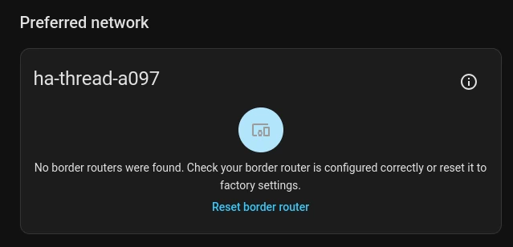
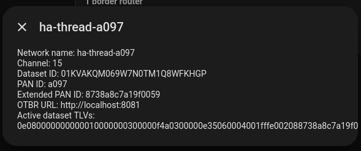

In early 2026 I hosted my personal Home Assistant (a open source server for
smart home devices) instance in Docker against all recommendations. I liked the
idea of containerizing all deployments. But this also meant that I needed to
setup all Home Assistant Apps by my self. When it came to Thread or specifically
OpenThread Border Router (OTBR) I ran into a problem that couldn't be solved.
The version that I was using had a bug.

[Bug Report at GitHub](https://github.com/openthread/ot-br-posix/issues/3429#issuecomment-5272504701)

## What went wrong

Home Assistant is not discovering the Border Router.

While it can communicate to the REST API.

After some research I found that Home Assistant is finding the Border Router
with mDNS. This process was broken. The OTBR project had switched from using
Avahi to a self made mDNS client. It was probably the cause of the bug.

## Result

Before the bug report was reviewed I needed a working server. I tried different
versions but none of the last few months seemed to work. So I switched to the
recommended way of running Home Assistant: a VM. Interestingly the Home Assistant
App is using a modified version of OTBR so the mDNS discovery is skipped entirely.

A few days later the team behind OTBR fixed the bug.

I felt honored to help an open source project.
